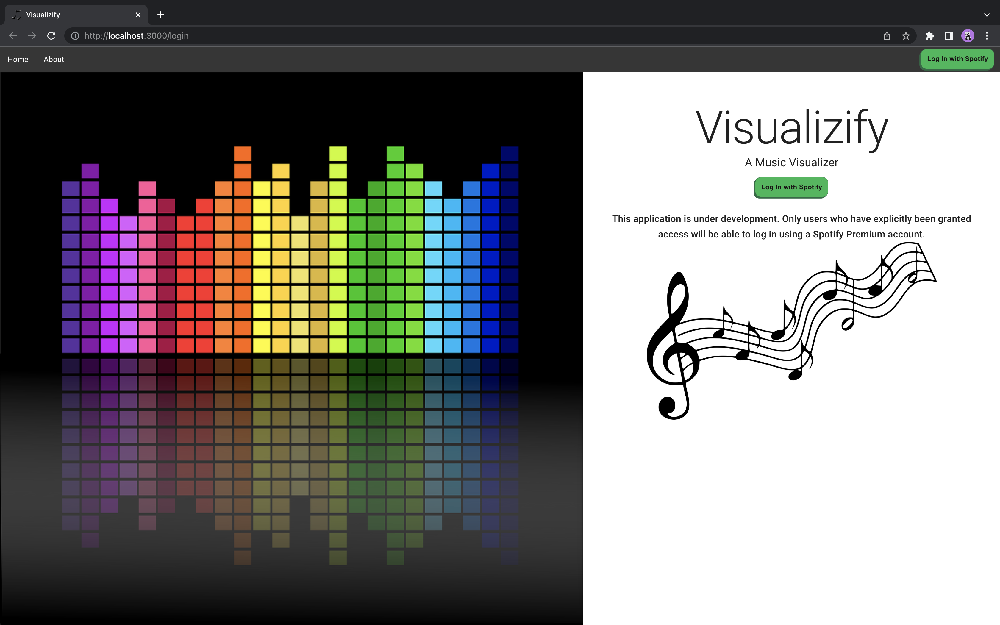
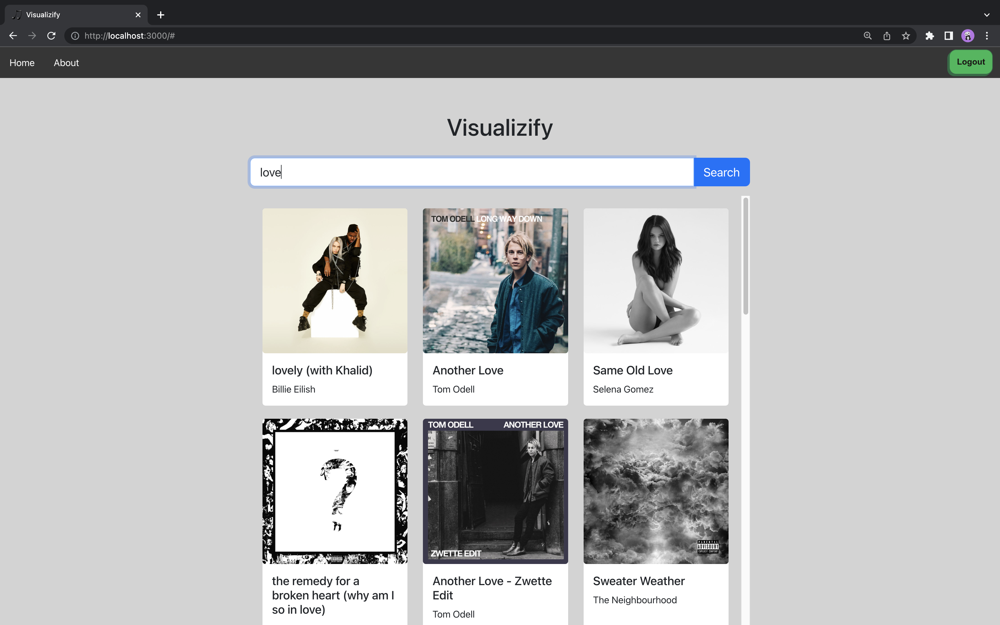
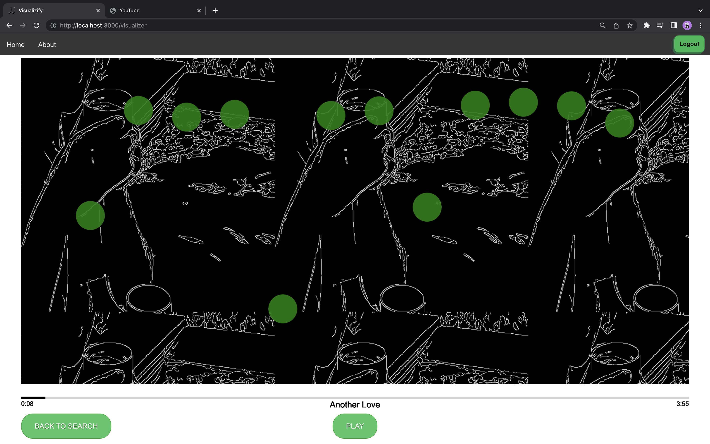

# README

## Overview

Visualizify is a React web app designed to enable those with hearing impairments experience music visually. After logging in with a Spotify premium account (granted access to the app by the devs), users are able to search for tracks, play them, and visualize the audio with images and patterns.

### Homepage

### Search Page

### Play Music and Visualize Page

## Setup

Install dependencies from `package.json` using: `npm install`

## Run

Runs the app in the development mode using: `npm start`

Open [http://localhost:3000](http://localhost:3000) to view it in your browser.